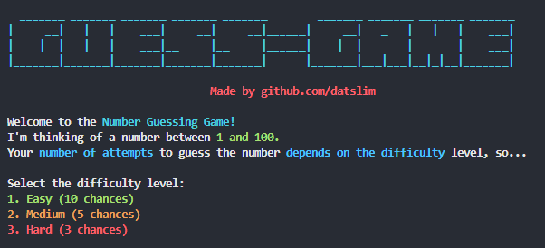
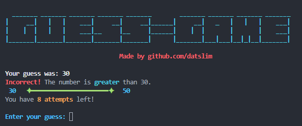
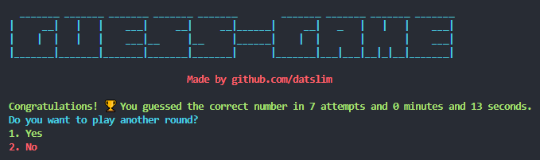

# Number Guessing Game 🎮

Welcome to the **Number Guessing Game**! This is a fun and interactive CLI game where you guess a randomly generated number within a specified range. The game offers multiple difficulty levels, hints, and a visually appealing interface with colored text.

---

## Table of Contents 📚

- [Features](#features)
- [Installation](#installation)
- [How to Play](#how-to-play)
- [Difficulty Levels](#difficulty-levels)
- [Contributing](#contributing)
- [License](#license)

---

## Features ✨

- **Multiple Difficulty Levels**: Choose from Easy, Medium, or Hard.
- **Hints**: Get hints like "higher" or "lower" to guide your guesses.
- **Dynamic Range**: The game dynamically updates the range of possible numbers based on your guesses.
- **Colored CLI Interface**: Enjoy a visually appealing command-line interface with colored text.
- **Timed Gameplay**: See how long it takes you to guess the correct number.

---

## Installation 🛠️

### Prerequisites
- Go installed on your machine (version 1.16 or higher recommended).

### Steps
1. Clone the repository:

   `git clone https://github.com/datslim/guessing-game-go.git`

2. Navigate to the project directory:
   `cd guessing-game-go`

3. Run the game:
    `go run main.go`

## How to Play 🎲

1. **Start the Game**: Run the game using `go run main.go`.
2. **Choose Difficulty**: Select a difficulty level (Easy, Medium, or Hard).
3. **Guess the Number**: Enter your guess when prompted.
4. **Get Hints**: The game will tell you if your guess is too high, too low, or correct.
5. **Win or Lose**: Keep guessing until you find the correct number or run out of attempts.

---

## Difficulty Levels 📊

| Difficulty | Attempts | Description                          |
|------------|----------|--------------------------------------|
| Easy       | 10       | Perfect for beginners.               |
| Medium     | 5        | A bit more challenging.              |
| Hard       | 3        | For the brave and experienced players. |

---

## Screenshots 🖼️

### Main Menu

### Gameplay

### Victory Screen

---

## Contributing 🤝

Contributions are welcome! If you'd like to contribute to this project, please follow these steps:

1. Fork the repository.
2. Create a new branch:
    ` git checkout -b feature/YourFeatureName`
3. Commit your changes:
    `git commit -m 'Add some feature'`
4. Push to the branch:
    `git push origin feature/YourFeatureName`
5. Open a pull request.

## License 📜

This project is licensed under the MIT License. See the [LICENSE](LICENSE) file for details.

---

## Acknowledgments 🙏

- Made with ❤️ by [Matvey Grachev](https://github.com/datslim).
- Inspired by classic number guessing games and [roadmap website!](https://roadmap.sh/projects/number-guessing-game)

---

Enjoy the game! 🚀